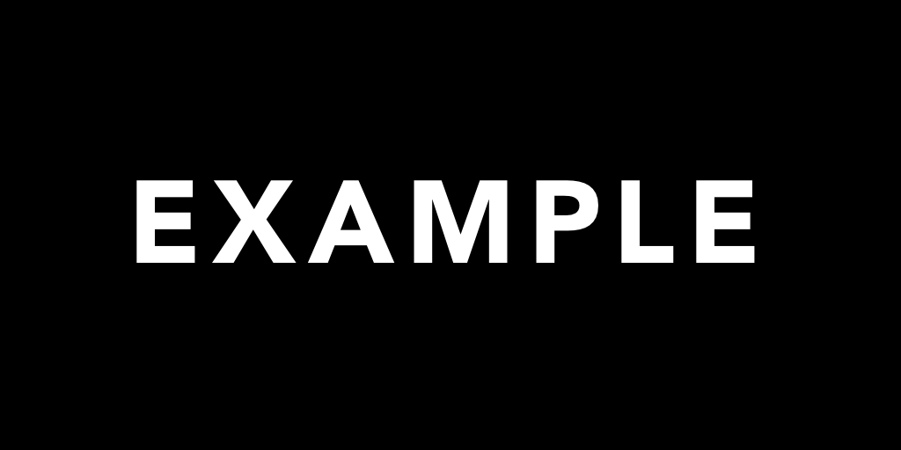

# AImages


A script for generating images that contain hidden text.

Blog post and motivation: https://www.factsmachine.ai/p/hidden-in-plain-sight

## Setup
### Modal
This script is designed to run on [Modal](www.modal.com) GPUs. Before running it, please set up your Modal account from your local machine. Please note that Modal is a commercial product


To run the script, clone this repo to your local machine and install the dependencies:

```
git clone https://github.com/jlowin/aimages
cd aimages
pip install -r requirements.txt
```
## Running

You'll need to create a control image. For best results, use a PNG of white text on a black background, like this one: 



Run the script with Modal, replacing the path and prompt appropriately:

```
modal run sd_controlnet.py \
    --control-image-path path/to/your/control/image \
    --prompt "a prompt to generate the full image" 
```

This will save an image on your computer.

Note: the first time you run this script, it will download all the model weights and create a Docker image for you. This can take a few minutes, but only needs to be done once. Subsequent runs should start in less than a minute and take only a few seconds to generate an image.


## Options

In addition to the control image and prompt, you can provide many options to control image generation:


| Setting | Default | Notes |
| --- | ---: | --- | 
| `--seed` | | Provide an integer seed value to "fix" the model rather than using a random starting point. The seed for every model is always printed to the logs for reference. |
| `--steps` | 30 | The number of model iterations to run. |
| `--n` | 1 | The number of images to generate. |
| `--negative-prompt` |  | Generated images will try to "avoid" this description |
| `--guidance-scale` | 7.5 | The strength of the prompt for the Stable Diffusion model. Values between 7-9 are generally recommended; higher values will attempt to represent prompts more literally. |
| `--controlnet-conditioning-scale` | 1.3 | The strength of the ControlNet. Values between 1-2 are effective; higher values make text more visible. |
| `--sd-model` | `Lykon/AbsoluteReality` |This script automatically downloads a few popular Stable Diffusion weights: `runwayml/stable-diffusion-v1-5` (the base SD model), as well as `SG161222/Realistic_Vision_V5.1_noVAE`, `Lykon/AbsoluteReality`, and `Lykon/DreamShaper`. You can choose any of them to adjust the style of your images. |

